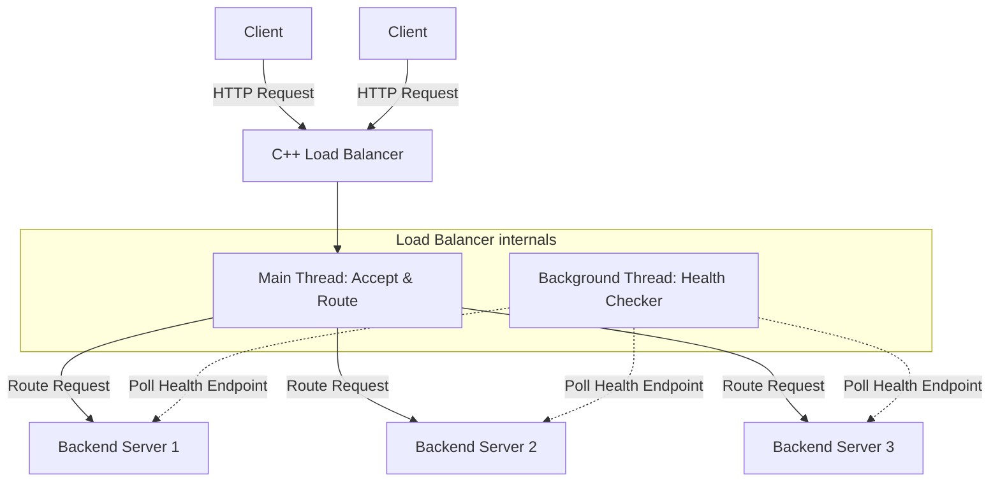
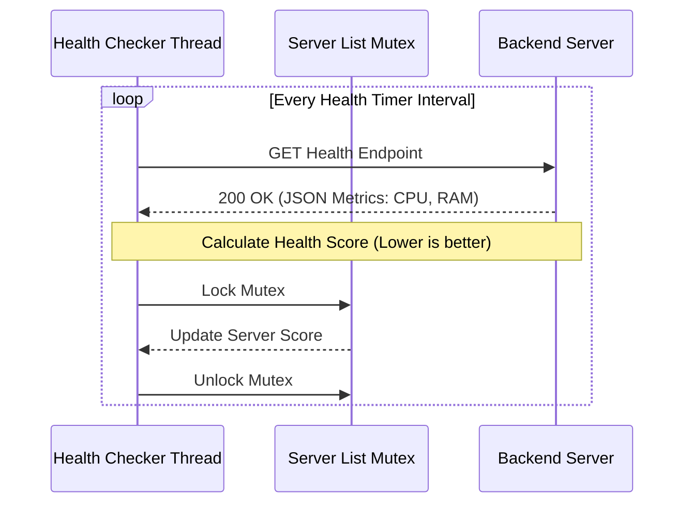

# C++ HTTP Load Balancer

This project is a technical exploration into low-level systems scaling, focusing on C++ socket programming and custom load balancing algorithms.

## System Architecture

The load balancer operates using a concurrent architecture to handle incoming traffic while continuously monitoring the health of backend servers.

- **Main Server Thread**: Binds to the listening port and accepts incoming HTTP connections from clients.
- **Request Parsing**: Uses `picohttpparser` to quickly parse HTTP requests.
- **Proxying / Forwarding**: Reads data from the client, forwards it to the selected backend server, and relays the backend's response back to the client using `select()` for non-blocking I/O.
- **Health Checker Thread**: A dedicated background thread that runs on a timer to poll the health endpoints of all registered backend servers.

### Architecture Flow



## Load Balancing & Health Scoring Algorithm

Unlike basic Round Robin or Random selection, this load balancer uses an intelligent scoring system based on real-time server metrics (CPU and RAM).

### 1. Health Polling
When the health timer triggers, the load balancer sends a request to the health endpoint of each backend server listed in `avaliableserver.txt`. 
The backend server responds with JSON data containing its current hardware utilization:
- CPU Usage percentage
- Number of CPU Cores
- RAM Usage
- Total RAM available

### 2. Base Score Calculation
A base score is calculated for each server. A **lower score means the server is healthier** and more capable of taking on new requests.

The formula normalizes the load based on hardware capacity:
- **CPU Score**: Factored by evaluating the available CPU percentage divided by the number of cores.
- **RAM Score**: Factored by evaluating the free RAM relative to the total RAM capacity.

### 3. Dynamic Weighting (Preventing Thundering Herd)
If multiple requests arrive simultaneously, simply picking the server with the lowest base score could result in sending all traffic to a single server before the health checker has time to update the scores. 

To prevent this, the algorithm applies a dynamic "user weight":
- It calculates the average score of all available servers.
- When a server is selected, an artificial penalty (weight) is added to its current score, proportional to the difference between its score and the average score.
- This ensures that as a server receives traffic, its score artificially increases, causing the load balancer to distribute subsequent requests to other servers until the next actual health poll resets the baseline.

### Health Checking Flow



## Build and Run

1. Ensure you have a C++ compiler (like g++ or MSVC) installed.
2. Compile the source code, making sure to link the Winsock library and threading.
   
   Example using g++:
   ```bash
   g++ server.cpp include/healthchecker.cpp include/loadbalancer.cpp include/picohttpparser.c -Iinclude -lws2_32 -pthread -o server.exe
   ```
3. Create an `avaliableserver.txt` file in the same directory containing the list of backend servers (e.g., `127.0.0.1:8080`).
4. Run the compiled executable. The load balancer will start listening on port 8000.